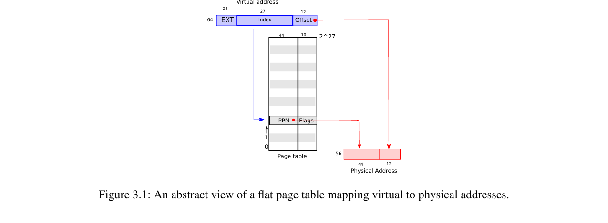
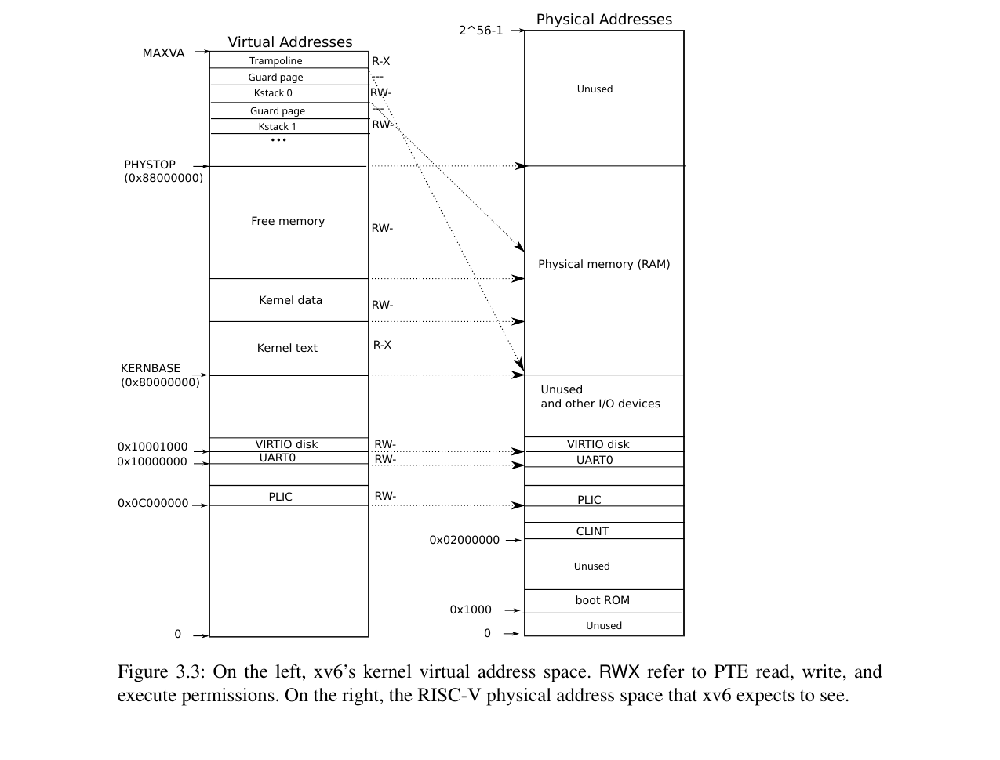

# Chapter 3 — Page Tables

> **각 프로세스에 "자기만의 메모리"가 있는 것처럼 보이게 하는 장치.**
> 실제로는 모두가 같은 RAM을 공유하지만, page table이라는 주소 번역표를 통해 서로의 메모리를 침범하지 못하게 막아준다.

---

## 왜 필요한가

- 컴퓨터에 RAM은 하나뿐인데, 여러 프로세스가 동시에 돌아간다.
- 그냥 두면 프로세스 A가 프로세스 B의 메모리를 망가뜨리거나 훔쳐볼 수 있다.
- 해결책: 프로세스가 쓰는 주소(=가상 주소)와 실제 RAM 주소(=물리 주소)를 **분리**하고, 그 사이를 page table이 자동으로 번역해 주게 한다.

---

## 핵심 개념 3가지

### ① 가상 주소 vs 물리 주소

| 종류 | 무엇 |
| --- | --- |
| **가상 주소** | 프로세스가 사용하는 주소. 프로세스마다 다른 의미를 가짐 |
| **물리 주소** | 실제 RAM의 주소 |

프로세스 A와 B 모두 "주소 0x1000"을 써도, 실제로는 **RAM의 서로 다른 칸**을 가리킨다. 그래서 A는 B의 데이터를 볼 수 없다 → 격리.

### ② Page Table = 주소 번역표

- 프로세스가 가상 주소를 사용하면 → CPU 안의 **MMU(번역 회로)** 가 page table을 참고해 → 자동으로 진짜 RAM 주소로 변환.
- 매핑 단위는 **페이지(=4KB)**.
- 매핑 정보 한 줄을 **PTE (Page Table Entry)** 라고 부른다.

### ③ satp 레지스터

- CPU에 있는 작은 슬롯. "**지금 어떤 page table을 쓸지**" 적혀 있다.
- 프로세스를 전환할 때 satp만 바꿔주면 → 가상 주소의 의미가 통째로 바뀐다.

---

## 그림으로 보기

가상 주소가 page table을 거쳐 물리 주소로 바뀌는 모습.



---

## PTE에 담긴 권한 플래그

각 PTE에는 단순히 "어디로 매핑되는지"만 들어있는 게 아니라, **접근 권한**도 같이 들어 있다.

| 플래그 | 의미 |
| --- | --- |
| **V** | 이 매핑이 유효한가 |
| **R / W / X** | 읽기 / 쓰기 / 실행 허용 |
| **U** | 사용자 코드가 접근해도 되는가 |

권한이 없는 접근은 즉시 **page fault**(예외)가 발생해서 커널이 잡아낸다.

---

## 커널 메모리 모양

xv6 커널도 page table을 하나 가지고 있다. 다만 커널은 **거의 대부분 "가상 주소 = 물리 주소"로 그대로 매핑**해 둔다 (= **direct mapping**). 그래야 커널이 RAM을 다루기 편하다.

예외 두 가지:

1. **Trampoline page** — 모드 전환할 때 쓰는 특수 코드 페이지
2. **Kernel stack 아래의 guard page** — 스택 바로 아래에 일부러 "사용 불가" 페이지를 두어, 스택이 넘치면 즉시 잡아낸다



왼쪽이 가상 주소 공간, 오른쪽이 실제 RAM. 화살표를 보면 거의 그대로 대응됨을 알 수 있다.

---

## Trampoline이란

이름 그대로 **"잠깐 밟고 튕겨 나가는 발판"** 같은 코드 페이지.

- 역할: **user mode ↔ kernel mode 전환**을 처리하는 어셈블리 코드
- 위치: 가상 주소 공간의 맨 위
- 특별한 점: **user의 page table과 kernel의 page table 양쪽에 같은 자리에 매핑**되어 있다

양쪽에 매핑되어 있어야 하는 이유는, 모드를 바꾸려면 satp(=page table)를 갈아 끼워야 하는데 갈아 끼우는 그 명령어 자체도 어딘가의 코드를 실행하는 중이기 때문이다. 새 page table에 그 코드 자리가 없으면 CPU가 다음 명령을 못 읽고 멈춘다. 그래서 양쪽 page table 모두 같은 자리에 있는 "공통 발판"이 필요하다.

---

## 물리 메모리 할당 (`kernel/kalloc.c`)

- 사용 가능한 RAM 페이지들을 **linked list**로 관리한다 (= freelist)
- `kalloc()`: 리스트에서 페이지 하나 꺼냄
- `kfree(p)`: 페이지 하나 돌려줌
- 항상 **4KB 페이지 단위**로만 할당 (가변 크기 없음)

---

## 프로세스 메모리 레이아웃

```
높은 주소 ─── Trampoline       ← 모드 전환용 발판
            Trapframe        ← 모드 전환 시 레지스터 저장 영역
            ...
            heap             ← malloc/sbrk 호출 시 위로 확장
            ↑
            user stack       ← 아래로 자람
            ↓
            data             ← 전역변수
            text             ← 프로그램 코드
낮은 주소 ───
```

각 프로세스마다 이런 모양의 가상 공간을 자기 page table로 갖는다.

---

## exec("프로그램명")이 하는 일

새 프로그램을 실행할 때:

1. ELF 파일에서 코드/데이터를 읽어옴
2. **새 page table을 만들고** 위 그림 같은 레이아웃으로 매핑
3. 시작 위치 세팅 후 user mode로 복귀
4. PID는 그대로 — **같은 프로세스가 새 코드를 실행**하는 것

---

## 요약

1. **page table = 프로세스마다 가진 "가상 → 물리" 번역표**
2. **MMU가 하드웨어로 자동 번역**, satp 레지스터가 "지금 어느 page table 쓸지"를 결정
3. **PTE에는 매핑 + 권한(R/W/X/U/V)** 이 같이 들어있다 → 접근 제어
4. **커널은 direct mapping**(가상 = 물리)이 기본
5. **트램펄린** = 모드 전환용 발판 (양쪽 page table에 같은 위치 매핑)

---

## 관련 코드 위치

| 파일 | 무엇 |
| --- | --- |
| `kernel/vm.c` | page table 만들고 매핑하는 함수들 |
| `kernel/kalloc.c` | 물리 페이지 할당 (`kalloc`, `kfree`) |
| `kernel/trampoline.S` | 모드 전환 어셈블리 |
| `kernel/exec.c` | exec 구현 (page table 갈아끼우기) |
| `kernel/memlayout.h` | 메모리 레이아웃 상수 |

---
